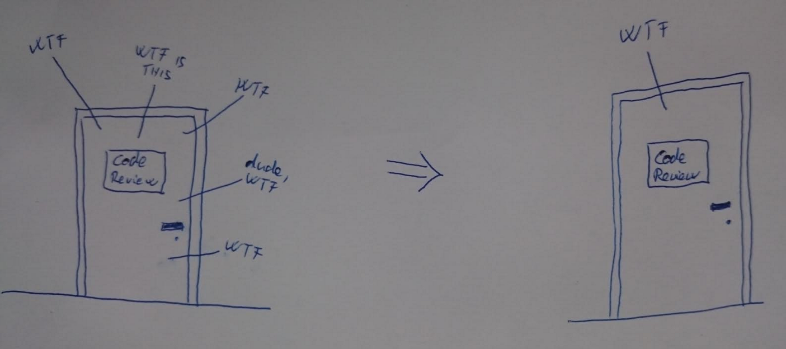

# eslint-config-server-shiwaforce

## Installation
```
npm install eslint eslint-config-server-shiwaforce --save-dev
```

## Main concept, the idea behind the things below



We want to work with beautiful, nicely formatted code, so with the help of eslint we aim to enforce it - as much as we can. In an ideal world everybody would write such high quality code. Until we reach this state to standardise code formatting the eslint plugin can be a great help.

## Usage
If you've installed eslint-config-server-shiwaforce locally within your project set your eslint config(`.eslintrc`) to:
```json
{
  "extends": "eslint-config-server-shiwaforce"
}
```
Run the linter by executing the command below:
```
./node_modules/.bin/eslint server/**/*.js
```

In case of a global installation the start the linter with...
```
eslint server/**/*.js
```

## Extending/Overriding the config
Add the `"rules"` key to your config then add your additional/override rules. For example, if you want to change the `"indent"` and `"eol-last"` rules from default to your own add this:
```json
{
  "extends": "eslint-config-server-shiwaforce",
  "rules": {
    "indent": [2, "space"],//indent with 2 spaces
    "eol-last":[0]//non error
  }
}
```
## Additional information about rules
[Eslint](http://eslint.org)
